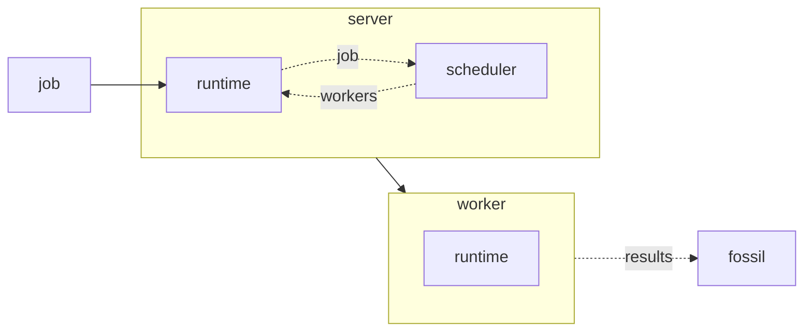

# Overview

Peltr is designed to provide those running applications in the cloud and specifically in kubernetes a way to run load, integration, and more complex tests without the need for direct access from the CICD systems.

- [Overview](#overview)
  - [Design](#design)
    - [Diagram](#diagram)
    - [Server](#server)
    - [Worker](#worker)
  - [Observability](#observability)
    - [Prometheus](#prometheus)

## Design

Overall Peltr comes in two parts, a server, and multiple workers. The server is where jobs are submitted and scheduled out to workers. The workers are where testing workloads are scheduled and sent.

### Diagram

### Server

Jobs are sent to the server over HTTP and are added to a job queue. The scheduler takes the job queue and the list of workers to determine if jobs are capable of being assigned and processed.

Workers connect to the server and announce an ID, capacity, and any additional information configured which the runtime saves in a worker list.

### Worker
Workers connect and announce themselves with the server and await for jobs. Once Jobs are assigned the runtime determines if the job is able to be run or needs to sit in the queue. Once a job can be run it is added to the active job and processed, with results being sent to the results store, default is fossil.

## Observability
### Prometheus 

- https://dev.to/kishanbsh/capturing-custom-last-request-time-metrics-using-prometheus-in-gin-36d6 